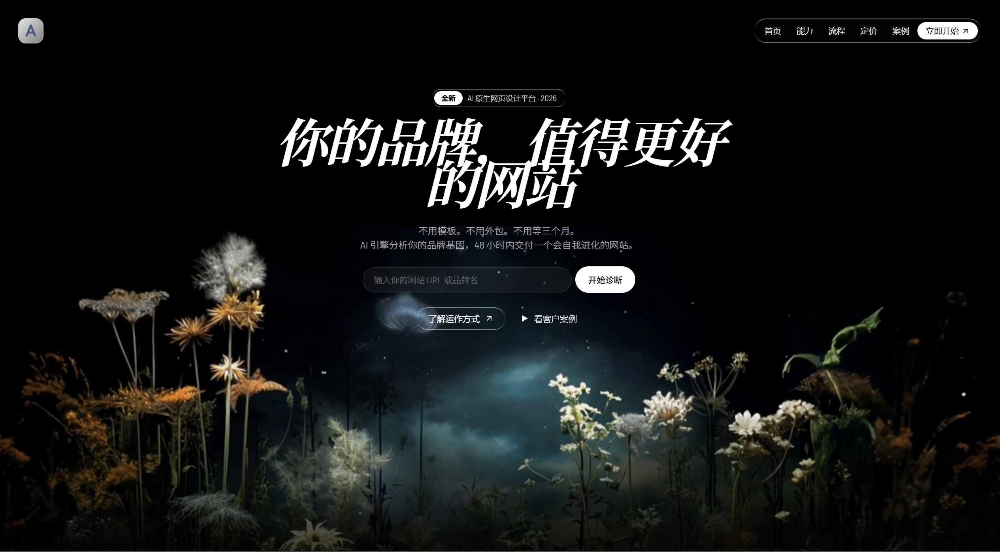
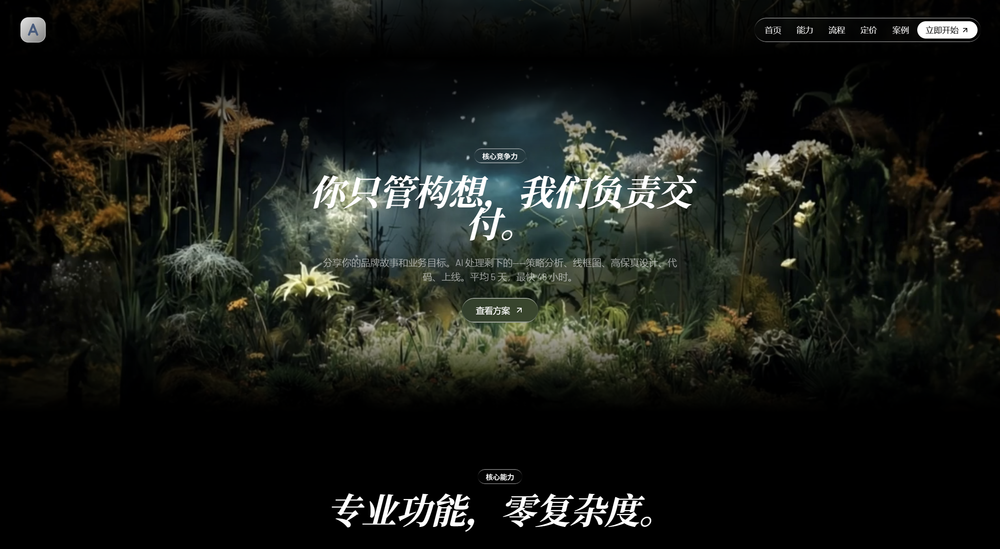
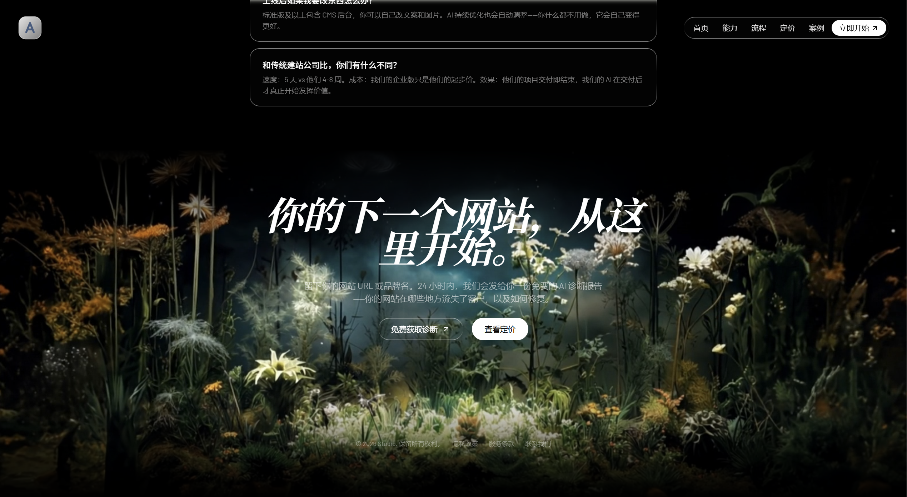

# Open Design 网站项目

这是一个使用 OpenDesign 平台仅花费 1 元人民币设计开发的网站项目。该项目的 UI 设计达到了极高水准，现决定开源供广大开发者参考学习，以践行开源精神，同时也表达对 OpenDesign 平台的衷心感谢。

## 项目概述

本项目展示了如何利用 OpenDesign 平台以极低的成本创建出高质量的 UI 设计作品。通过开源此项目，希望能够帮助更多开发者了解和使用 OpenDesign 工具，同时也为前端设计与开发提供一个可供参考的实例。

## 项目链接

- **代码仓库地址**：[https://github.com/nexu-io/open-design](https://github.com/nexu-io/open-design)
- **在线体验页面**：[https://evedensity.github.io/open-design-Test/](https://evedensity.github.io/open-design-Test/)

## 页面展示

### 首页



### 功能页



### 关于页



## 技术栈

- **设计工具**：OpenDesign
- **前端技术**：[请在此处补充实际使用的前端技术栈]
- **部署平台**：GitHub Pages

## 项目结构

```text
minedensity/
├── test/
│   └── demo.html        # 页面源码
├── screenshots/         # 页面截图（请自行添加）
└── README.md            # 项目说明文档
```

## 开源精神

本项目遵循开源精神，允许开发者：

- 自由使用、复制和分发本项目代码
- 基于本项目进行修改和二次开发
- 将修改后的作品用于商业或非商业用途

希望通过开源共享，能够促进设计与开发社区的共同进步。

## 致谢

特别感谢 OpenDesign 平台提供如此强大且经济实惠的设计工具，使得个人开发者也能轻松创建出专业级别的 UI 设计作品。

## 许可证

[请在此处添加适当的开源许可证信息，如 MIT 许可证等]
